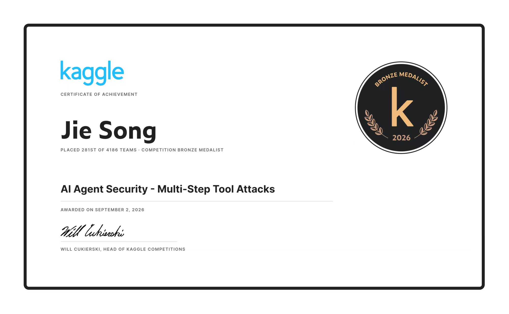

# Award record

The submission received a **Competition Bronze Medal** in **AI Agent Security: Multi-Step Tool Attacks**, placing **281st of 4,186 teams**. The certificate records the award date as **September 2, 2026**.

## Result details

| Item | Details |
| --- | --- |
| Competition | [Official competition page](https://www.kaggle.com/competitions/ai-agent-security-multi-step-tool-attacks) |
| Organizers | OpenAI, Google, and IEEE ([official rules](https://www.kaggle.com/competitions/ai-agent-security-multi-step-tool-attacks/rules)) |
| Name on certificate | Jie Song |
| Result | Competition bronze medalist |
| Placement | 281st of 4,186 teams |
| Relative standing | Top 6.7%, calculated as `281 / 4186 × 100` and rounded to one decimal place |
| Award date | September 2, 2026 |
| Certificate | [Original certificate image](../assets/kaggle-bronze-certificate.jpg) |

## Certificate

The name, placing, team count, medal, and award date above come from this certificate. The top-6.7% figure is calculated from its rank and team count; it is not a separate figure printed on the certificate.

The image is included without alteration. The leaderboard link opens the competition leaderboard; it is not a personal profile or a direct link to a team entry.

## Note on scope

The submitted code is my team's, adapted from a public Kaggle notebook by Adhiraj Jagtap. This repository is a technical analysis of that method; see [provenance](provenance.md) for what is original material and what was prepared for this repository.
